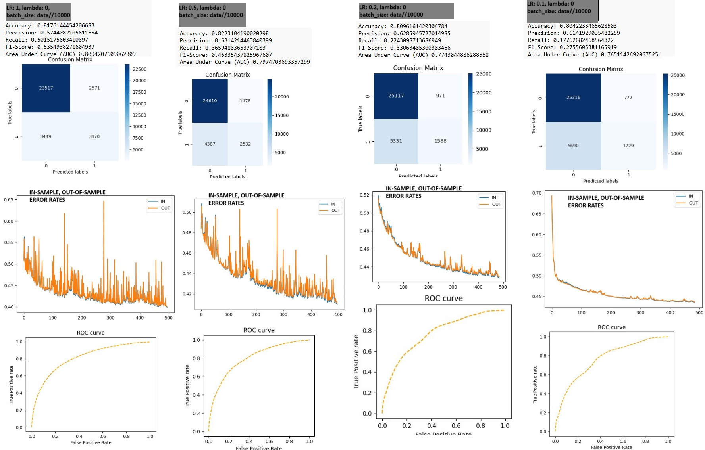

# Logistic Regression Model Analysis

## Introduction

This document provides an analysis of the Logistic Regression model used in this project. We detail the effects of hyperparameter tuning, specifically the learning rate (`LR`) on model performance.

## Parameters

- **Learning Rate (LR):** Controls the step size during the iterative optimization process.
- **Batch Size:** Size of batches for gradient descent.
- **L2 Regularization Coef:** The L2 regularization coef. to prevent overfitting.
- **Number of Iterations:** The number of iterations.

## Experiment Setup

- **Learning Rate (LR):** Varied across experiments to observe the impact on model performance.

    - Tested with the values `1`, `0.5`, `0.2`, `0.1`

- **Batch Size:** Number of data // 10000 -> (~16)

- **L2 Regularization Coef:** Kept constant 0

- **Number of Iterations:** Kept constant 500

## Model Performance Observations

### Accuracy Improvement
Increasing the learning rate results in improved accuracy metrics:
- Accuracy
- Precision
- Recall
- F1-Score
- AUC (Area Under Curve)

This suggests that larger updates to the model weights help the model to converge faster to a robust set of parameters.

### Error Rate Volatility
A higher learning rate introduces greater fluctuations in error rates, indicating a trade-off between faster convergence and stability of the learning process.

### Confusion Matrix Analysis
With an increased learning rate, the model shows a higher number of correctly classified instances, as indicated by the values in the confusion matrix.

### ROC Curve and AUC
The Receiver Operating Characteristic (ROC) curve and the Area Under Curve (AUC) metrics show improvement with a higher learning rate, indicating better model discrimination capability.

## Conclusion

The analysis indicates that while a higher learning rate can improve overall model performance, it also increases the variability of error rates. It is essential to find a balance between learning rate and regularization to ensure the model is not only accurate but also generalizable to new data. Also increasing number of iterations and decreasing the learning rate while using small batch sizes would improve the result.

---
